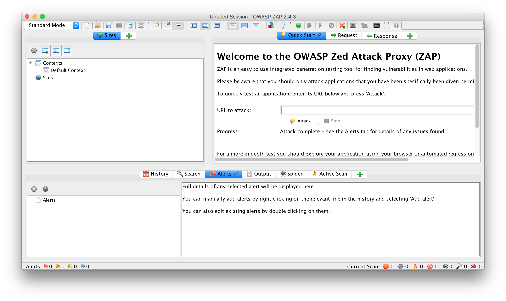
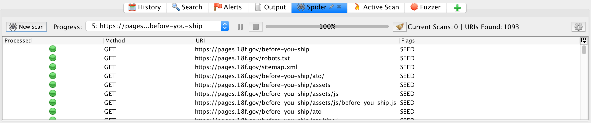
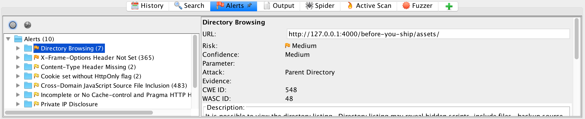

In order for an application to get ATO, it needs to meet more than a minimum level of application security, so the application team needs to run [both static and dynamic security scans](../scanning/) and document good results. Running a "dynamic" scan means running a program that analyzes a live running application for common vulnerabilities.

As part of the process of getting an ATO at 18F, **your application team will need to set up [OWASP ZAP](https://www.owasp.org/index.php/OWASP_Zed_Attack_Proxy_Project) to do dynamic vulnerability scanning of your application (either automated or manual scans)**. ZAP can function as either an active (Spider & Attack options) or a passive (man-in-the-middle/proxy) scanner, but is usually used as a combination of both. If you (or another person on your application team) has questions about setting this up, ask #infrastructure for help.

### Preface

You will need a running application to test, which you will want to be as production-like as possible—ideally a staging environment. Running a scan can cause a spike in requests and errors, so **inform your team and [#infrastructure](https://18f.slack.com/messages/infrastructure/) if you are going to run it on a production site.**

We gave an introduction to ZAP talk as part of our engineering tech talks series.

<iframe width="420" height="315" src="https://www.youtube.com/embed/2Dp7pAvKHaM" frameborder="0" allowfullscreen></iframe>

Slides and additional information available [here](https://github.com/18F/tech-talks/tree/master/vuln-scanning).

Using the the [Quick Start](https://github.com/zaproxy/zap-core-help/wiki/HelpAddonsQuickstartQuickstart) is a good way to get a basic idea of what ZAP does.

### Automated scanning

[Compliance Viewer](https://compliance-viewer.18f.gov) runs ZAP scans regularly for sites that opt in. This is an important element of [continuous monitoring](../../ato/walkthrough/#step-7--continuously-monitor-the-controls).

See the `New Project?` instructions in Compliance Viewer for how to get it set up.

#### Caveats

* [**There is no way to mark false positives.**](https://github.com/18F/compliance-viewer/issues/57) For ATO purposes, submit a document linking to your project in Compliance Viewer to [the `ATOs` folder in Drive](https://drive.google.com/a/gsa.gov/folderview?id=0BynIxtx-CfkdckljM3BPSkdQT1U&usp=sharing), and include the explanations in there.
* [**There is no authentication support.**](https://github.com/18F/concourse-compliance-testing/issues/98) For any sites that have authentication, you will need to scan the sites manually, as described below.

### Manual scanning

1. [Set up ZAP as a proxy.](https://github.com/zaproxy/zap-core-help/wiki/HelpStartProxies)
    * Unfortunately, the "Plug-n-Hack" extension mentioned on the Quick Start page is [currently non-functional](https://github.com/zaproxy/zaproxy/issues/2069).
    * If the browser gives you a certificate error (e.g. `"This site uses HTTP Strict Transport Security (HSTS) to specify that Firefox may only connect to it securely."`), you will need to install ZAP's root certificate.
      * In ZAP, go to `Tools`->`Options`->`Dynamic SSL Certificate` and click the `Save` button to save the certificate to your computer. 
      * You will then need to install the certificate. For Firefox, go to `Preferences`->`Advanced`>`Certificates`->`View Certificates`->`Import` to import the certificate you saved from ZAP. 
      * For additional information see ZAP's [documentation on Dynamic SSL Certificates](https://github.com/zaproxy/zap-core-help/wiki/HelpUiDialogsOptionsDynsslcert).
1. Seed the scanner.
    1. Navigate through the various types of pages/interactions on your site, including signing in. You should see domain name(s) start to show up under the `Sites` list.
    1. For each of the domains in the `Sites` list that you control (i.e. not `https://fonts.googleapis.com`):
        1. Right-click the domain to bring up the context menu.
        1. Select `Include in Context`->`Default Context`.
        1. In the `Session Properties` window that pops up, click `OK`.
1. Run the spider.
    1. In the menu bar, click `Tools`->`Spider...`.
    1. Click `New Scan`.
    1. Next to `Starting point`, click `Select...`.
    1. In the `Select Node` window, click `Default Context`, the `Select`.
    1. Click `Start Scan`.
    1. You should see the `Spider` table fill up with results, but the domains you don't control should say `OUT_OF_CONTEXT`.
1. If your site uses AJAX, run the [AJAX Spider](https://github.com/zaproxy/zap-core-help/wiki/HelpAddonsSpiderAjaxConcepts).
1. Run the actual scan.
    1. In the menu bar, click `Tools`->`Active Scan...`.
    1. In the `Active Scan` window, follow the same `Starting point` steps as above.
1. View the alerts.
    1. Click the `Alerts` tab.
    1. Above the `Alerts` list, click the  (so that it turns red) to `Show only URLs in scope`.
1. [Investigate the listed alerts.](#alerts)
1. [Mark false positives.](http://stackoverflow.com/a/24779317/358804)
1. Export the results.
    1. In the menu bar, go to `Report` -> `Generate HTML Report`.

### Examining the Results

#### The Spider

As configured, the Spider does not follow links to other domains or subdomains. If your project uses either (for example, you use S3 for assets, or the api is at a different sub domain), you will want to click  and update the options to include the domains & subdomains within the scope. There is a guide available for those options [here](https://github.com/zaproxy/zap-core-help/wiki/HelpUiDialogsOptionsSpider).

#### Alerts

The Alerts pane lists all alerts discovered while scanning the site. As described on the [alerts page](../scanning#alerts), the red and orange-flagged alerts must be taken care of before the application can be ATO'd. You have a little more flexibility when dealing with the yellow and blue flags, but all of them must be either corrected or, in the case of false positives, documented.

If you're running the attack against a local server you may see some alerts that you wouldn't see on cloud.gov. Debugging web servers are more 'chatty' about errors than production servers.

### Other Tools Within ZAP

#### Fuzzing

["Fuzzing"](https://en.wikipedia.org/wiki/Fuzz_testing) refers to feeding a large amount of random (and/or potentially malicious) data to an application with the intention of finding vulnerabilities related to poor error handling or incomplete input validation. Typically, fuzzing is used on query parameters and form fields.

Any request in ZAP can be fuzzed. Simply right click on it, select Attack -> Fuzzer. Read more about ZAP's Fuzzing capabilities [here](https://github.com/zaproxy/zap-core-help/wiki/HelpAddonsFuzzConcepts).

### More Information

The [ZAP User Guide](https://github.com/zaproxy/zap-core-help/wiki) is phenomenal. If you run into an issue, this should be the first place you check.

The [OWASP Vulnerable Web Applications Directory](https://www.owasp.org/index.php/OWASP_Vulnerable_Web_Applications_Directory_Project#tab=Main) has a great list of (intentionally) vulnerable targets that are useful for testing the capability of ZAP.

We are currently collecting best practices for using ZAP. If you have a particular approach, extension, or option that you find effective, let us know in #cloud-gov-highbar or [open an issue](https://github.com/18f/before-you-ship/issues/new)!
