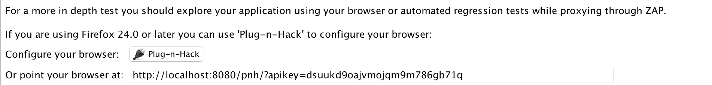

[OWASP ZAP](https://www.owasp.org/index.php/OWASP_Zed_Attack_Proxy_Project) is the tool we use for doing automated vulnerability scanning.

## Usage

You will need a running application to test, which you will want to be as production-like as possible. The 'Attack' scripts shouldn't do anything destructive, but will cause a spike in requests and errors. **Inform your team and #devops before running it on live (not locally-hosted) sites.**

1. [Install the ZAP desktop app](https://github.com/zaproxy/zaproxy/wiki/Downloads).
1. In the Quick Start tab, enter the URL of your application.
    * While you will need to run against production for the official ATO, you can also try out ZAP running against a local server.

1. Click "Attack".
    * You should see a bunch of URLs start to pop up in the Spider tab, then the Active Scan tab.
    * This will take a while.
    * There is a progress bar in the Spider and Active Scan tabs. You can click the  button in the latter to get more details.
1. Wait for the "Progress" area to say say "Attack complete".
1. Open the Alerts tab.

You can now click on each alert to see more details.

### Examining the Results

#### The Spider

As configured, the Quick Start Attack scan does not follow links to other domains or subdomains. If your project uses either, you will want to click  and update the options to include the domains & subdomains within the scope.

#### Alerts

The Alerts pane lists all alerts discovered while scanning the site. The red and orange-flagged alerts must be taken care of before the application can be ATO'd. You have a little more flexibility when dealing with the yellow and blue flags, but all of them must be either corrected or, in the case of false positives, documented.

Some of the alerts are caused by running the application with the debugging web server instead of the approved production server.

### Authentication

Testing the application in an authenticated state is easiest when done with ZAP acting as a Man In The Middle Proxy. Setting up with Firefox via the "Plug-n-Hack" extension is available right from the Quick Start page.

Authentication can be handled in several ways; the following links provide guidance on handling the most common forms. If these are insufficient, the authentication method is scriptable.
 
* <https://github.com/zaproxy/zap-core-help/wiki/HelpStartConceptsAuthentication>
* <https://github.com/zaproxy/zaproxy/wiki/FAQformauth>

### Other Tools Within ZAP

#### Ajax Spider

The Attack Script runs the Active Scan and Spider functions. If your page is a javascript-driven single page application, you will want to run the Ajax Spider in addition to the standard spider. The Ajax Spider will instantiate a browser window and spider the application visually. This is significantly slower than the standard spider.

### More Information

The [OWASP Vulnerable Web Applications Directory](https://www.owasp.org/index.php/OWASP_Vulnerable_Web_Applications_Directory_Project#tab=Main) has a great list of (intentionally) vulnerable targets that are useful for testing the capability of ZAP.

We are currently collecting best practices for using ZAP. If you have a particular approach, extension, or option that you find effective, let us know in #compliance-toolkit or [open an issue](https://github.com/18f/before-you-ship/issues/new)!

