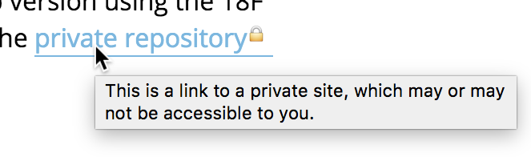

# Private Eye


<!-- c/o https://pixabay.com/en/detective-male-man-profile-156465/ -->

A JavaScript plugin to warn users about links to private pages. Places a :lock: icon next to any links with any URLs that you specify as private, and gives a warning message:



At 18F, this is used on public sites that contain links to internal content like private GitHub repositories or Google Docs. Rather than write two versions to redact those links, this allows us to publish new content and give a warning to both staff and external readers.

## Installation

Compatible with modern browsers (IE 9+). No dependencies.

### Script

Private Eye can be included as a normal script on your page, exposing a `PrivateEye` global.

```html
<script src="private-eye.js"></script>
```

### CommonJS

Private Eye supports CommonJS, and is thus compatible with [Browserify](http://browserify.org/), [WebPack](https://webpack.github.io/), etc.

1. Install the module.

    ```bash
    npm install --save @18f/private-eye
    ```

1. Include in your application:

    ```javascript
    var PrivateEye = require('private-eye');
    ```

## Usage

```javascript
document.addEventListener('DOMContentLoaded', function() {
  PrivateEye({
    // list of URLs to match as substrings – can be full URLs, hostnames, etc.
    ignoreUrls: [
      'http://so.me/private/url',
      'anoth.er',
      ...
    ]
  });
}, false );
```

## See also

* [Redacting content through 18F Pages](https://github.com/18F/pages-server/blob/master/README.md#publishing-to-internal-and-external-sites-from-the-same-branch)
