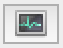

# The OWASP Zed Attack Proxy (ZAP)

[OWASP ZAP](https://www.owasp.org/index.php/OWASP_Zed_Attack_Proxy_Project) is a tool for doing automated vulnerability scanning.

## Usage

You will need a running application to test, which you will want to be as production-like as possible. Before testing, make sure to let your team know, as they may see a spike in requests and errors.

1. [Install the ZAP desktop app](https://github.com/zaproxy/zaproxy/wiki/Downloads).
1. In the Quick Start tab, enter the URL of your application.
1. Click "Attack".
    * You should see a bunch of URLs start to pop up in the Spider tab, then the Active Scan tab.
    * This will take a while.
    * There is a progress bar in the Spider and Active Scan tabs. You can click the  button in the latter to get more details.
1. Wait for the "Progress" area to say say "Attack complete".
1. Open the Alerts tab.

You can now click on each alert to see more details.

### Authorized requests

TODO

* https://github.com/zaproxy/zaproxy/wiki/FAQformauth
